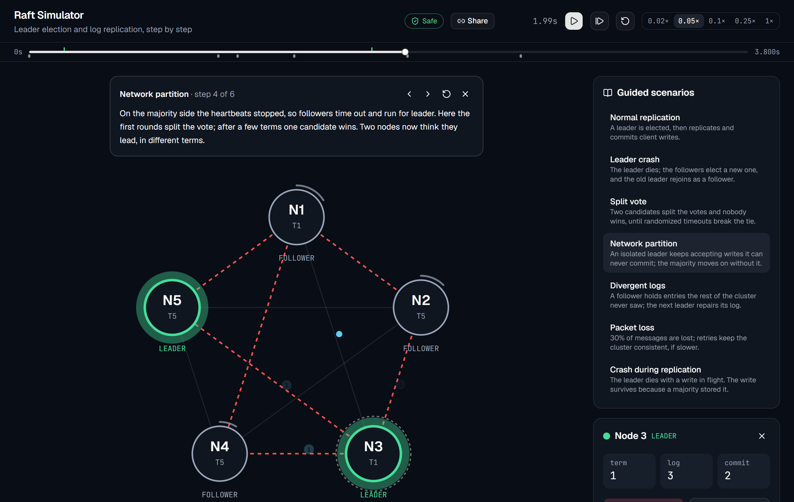

# Raft Simulator

[](https://github.com/ysaatci/raft-sim/actions/workflows/ci.yml)
[](https://github.com/ysaatci/raft-sim/actions/workflows/deploy.yml)

An interactive, visual simulator of the [Raft consensus algorithm](https://raft.github.io/).
Crash nodes, cut network links, add latency and packet loss, and watch leader election and
log replication recover, one message at a time.

**▶ [Open the simulator](https://ysaatci.github.io/raft-sim/)**. It runs entirely in your browser.



## What you can do

- **Watch Raft work.** Every message is drawn in flight: votes in violet, log appends in blue,
  responses as rings, rejections in red. Election timers fill up around each node.
- **Break things.** Click a node to crash, restart or pause it. Click a link to cut it, or split
  the cluster in two. Slide latency, jitter and packet loss for every link or just one.
- **Follow the logs.** The log grid shows every node's log side by side, colored by term. Solid
  cells are committed, outlined ones aren't yet, so divergence and repair are easy to see.
- **Rewind.** Drag the timeline back to any moment, or click an event ("N5 became leader of
  term 2") to jump there. Doing something in the past starts a new branch.
- **Learn with guided scenarios.** Seven narrated scripts: normal replication, a leader crash, a
  split vote, a network partition, divergent logs, packet loss, and a crash during replication.
- **Share a moment.** *Share* copies a link that reopens this exact run at this exact moment.
- **Trust it.** A live checker verifies Raft's four safety properties on every state change; the
  badge in the header turns red if one is ever broken.

Keyboard: <kbd>Space</kbd> play/pause · <kbd>→</kbd> step · <kbd>1</kbd>–<kbd>9</kbd> select a node · <kbd>Esc</kbd> deselect.

## How it works

```
┌──────────────── React + Vite (TypeScript) ─────────────────┐
│  ClusterRing · LogGrid · Inspector · Timeline · Narration  │
│                   SimulationClient                         │
└──────────────────────────┬─────────────────────────────────┘
                           │ postMessage (JSON)
                 ┌─────────▼──────────┐
                 │ Web Worker         │
                 │ raft.wasm (Go)     │
                 └─────────┬──────────┘
   ┌───────────────────────▼──────────────────────────────────┐
   │ backend/sim   virtual clock · simulated network · replay │
   │               invariant checker · scenarios              │
   │ backend/raft  pure, deterministic Raft core              │
   └──────────────────────────────────────────────────────────┘
```

- **The Raft core is a pure state machine** (`backend/raft`). It starts no goroutines and reads no
  clocks. Time arrives through `Tick()`, messages through `Step()`, and output leaves through
  `Ready()`. Randomness comes from a seeded source.
- **The simulator is deterministic** (`backend/sim`). Virtual time is in milliseconds, and the
  network decides each message's delay or loss from its own seeded stream. The same seed and
  the same actions always produce the same run.
- **Rewind is replay.** The simulator records only user actions. Seeking backwards rebuilds the
  cluster from its seed and replays the actions, which recreates the exact state. Shared links
  work the same way: a link holds the config and the actions, not the state.
- **It all runs in the browser.** The Go code compiles to WebAssembly (about 1.2 MB gzipped)
  and runs in a Web Worker, so the page stays smooth. 60 seconds of simulated time runs in
  about 60 ms.

Next up is **cluster mode**: the same Raft core running as five real processes under Docker
Compose, driven by the same UI (see [plan.md](plan.md), Milestone 7).

### What's implemented

Leader election with randomized timeouts · log replication with conflict backtracking
(whole-term skips) · the leader's no-op on election · the current-term commit rule (Figure 8) ·
persistent term, vote and log across crashes.

Not yet: PreVote, CheckQuorum, snapshots, membership changes (plan.md, Milestone 8).

## Testing

| Layer | What runs |
|---|---|
| Raft core | Unit tests for every rule in the paper, including a Figure 8 regression test |
| Simulator | Integration tests; **randomized chaos runs** (crashes, pauses, partitions, lossy links) checking all four safety properties throughout, plus recovery at the end; `go test -fuzz` over random action sequences |
| Scenarios | Each guided scenario is replayed and held to what its narration claims |
| WASM | A Node smoke test of the compiled module; frontend tests drive the real `raft.wasm` |
| Frontend | Vitest + Testing Library, about 98% coverage |
| End to end | Playwright against the production build |

A failing chaos seed prints its own replay command:

```bash
go test ./sim -run TestChaos -seed=1234 -v
```

## Local development

Requires **Go 1.24+** and **Node 24+**.

```bash
cd frontend
npm ci
npm run dev        # builds raft.wasm, then serves http://localhost:5173
```

```bash
cd backend && go test ./...                      # Go tests
cd frontend && npx vitest                        # frontend unit tests
cd frontend && npm run build && npm run e2e      # Playwright (set PW_CHANNEL=msedge to use Edge)
```

With `make`: `make test`, `make test-docker` (Go with `-race` and coverage in a Linux container),
`make wasm`, `make fe-dev`.

### Layout

```
backend/raft/       Raft core
backend/sim/        simulator, invariant checker, scenarios, chaos and fuzz tests
backend/bridge/     JSON API used by the WASM entry point
backend/cmd/wasm/   syscall/js entry point + Node smoke test
frontend/           React app (src/), Playwright tests (e2e/)
scripts/            build-wasm.mjs
```

The project is built in small steps following [plan.md](plan.md).

## License

[MIT](LICENSE)
